# Speedrun Bot for Discord

A verified Discord bot that retrieves speedrunning and racing information.

Click this [link](https://discordapp.com/oauth2/authorize?client_id=545399263253757953&scope=bot) to authorize Speedrun Bot to join your server.

# Speedrun.com Commands

**Get world record of a game:** `!src game`

Gets the world record in the main category for a specific game. 

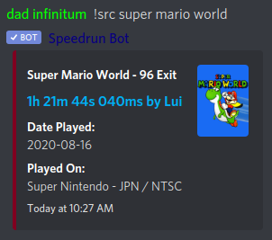

*Note:* game name searching is not perfect (by speedrun.com's API's design), so a better way to search is by the game's speedrun.com abbreviation. **This abbreviation-style searching for games works for all commands.**

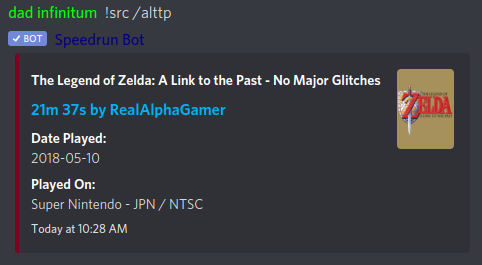

**Get world record of a specific category of a game:** `!src game;category|sub-category`

Gets the world record in a specific category for a specific game.

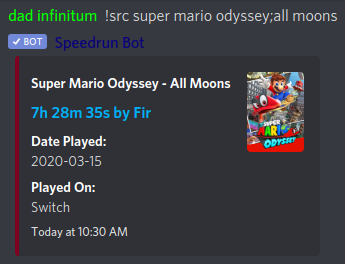

Sub-category is optional, and dependent on the game.

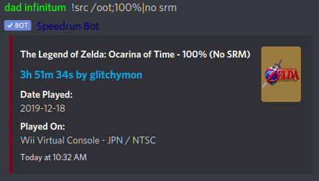

**Get a list of a game's categories:** `!src game;*`

Gets a list of all categories for a specific game.

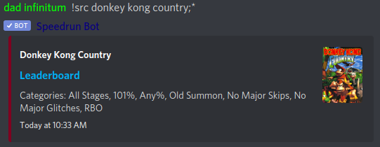

If you want to include miscellaneous categories, include a `+` at the end.

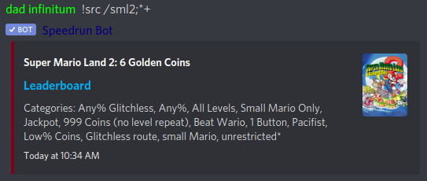

*Note:* some games have sub-categories, and they can be retrieved with `!src game;category|*`.

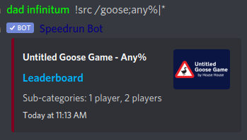

**Get the rules of a category of a game:** `!src game;category?`

Gets the rules for a category of a specific games.

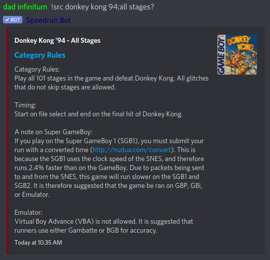

*Note:* some categories do not have rules, but their sub-categories do. The rules of a subcategory can be retrieved using `!src game;category|sub-category?`. If the sub-category does not have rules, the category's rules are returned.

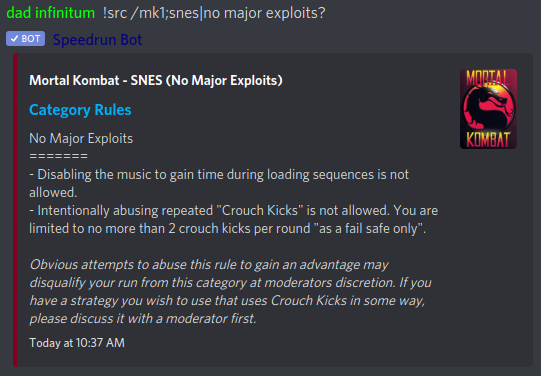

**Get the personal best of a runner:** `!src game;category|sub-category;runner`

Gets a person best for a specific runner in a specific category of a specific game. As before, sub-category is optional and dependent on the game.

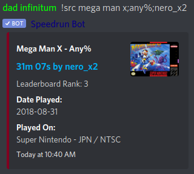

*Note:* runner name searching is also not perfect (again, by the API's design), but you can search by Twitch username if you add a `*` at the end of the name. This, however, depends on the user registering their Twitch username on speedrun.com.

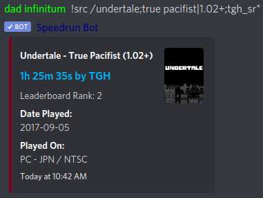

# Racetime.gg Commands

**Get leaderboard rankings**: `!rtgg slug`

Gets the top 10 (or top X if the number of racers is less than 10) of a category's leaderboard for the most raced goal, sorted by score.

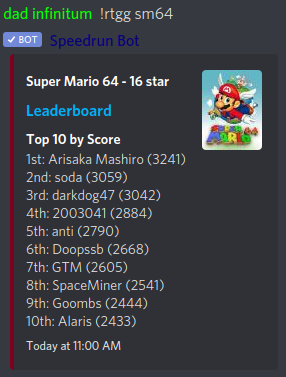

**Get leaderboard rankings of a goal**: `!rtgg slug;goal`

Gets the top 10 (or top X if the number of racers is less than 10) of a specific goal on a category's leaderboard, sorted by score.

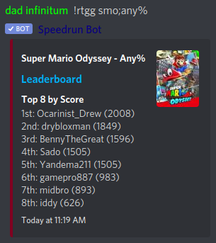

Appending `*` to the goal sorts results by best time.

Appending `+` to the goal sorts results by most races.

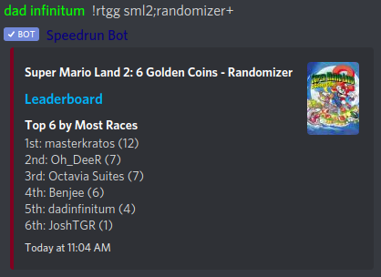

**Get a list of a game's goals**: `!rtgg slug?`

Gets a list of a game's goals.

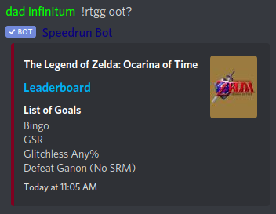

**Get leaderboard stats of a racer in a goal**: `!rtgg slug;goal;racer`

Gets the score, best time, and number of races for a racer, including their rank for each.

# Report a Bug

If you have any issues, please report them to the [GitHub](https://github.com/slashinfty/srcom-bot/issues).

## Most Recent Updates

11 October 2020 - Updated readme. Added racer stats from [racetime.gg](https://racetime.gg).

31 May 2020 - Added [racetime.gg](https://racetime.gg) leaderboard command.

21 February 2020 - Returns a list of subcategories when the rules of a category do not exist.

18 February 2020 - Added the ability to search for sub-category rules. Game rules are not in the SRC API yet, though.

25 January 2020 - Added the ability to search for category rules.

30 May 2019 - Provides proper name feedback on queries that have no results.

20 February 2019 - Added a reply for queries that result in games/categories with no runs.

19 February 2019 - Get all sub-categories command; descriptive "can't find" replies; find WRs by runners who are not users ("guests").
